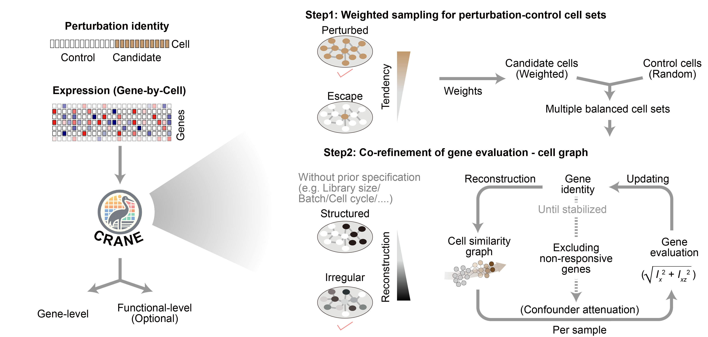
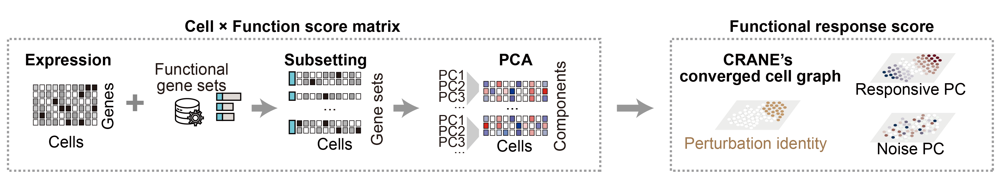

# CRANE

CRANE (Co-alignment Response Analysis via Neighborhood-aware Evaluation) is a Python package for quantifying perturbation responses from single-cell expression data.

It is designed for single-cell perturbation experiments where a perturbation label alone may not cleanly separate responding cells from controls. Examples include CRISPR perturbation screens, Perturb-seq style assays, drug perturbation datasets, and other experiments where perturbation efficiency, cell state variation, batch effects, library size, or cell cycle can obscure the response signal.

CRANE asks a gene-level question:

> Does this gene respond to the perturbation, and how strongly?

It can also evaluate pathway or gene-set level responses on the same learned response graph.



## What CRANE Does

CRANE evaluates perturbation response on a cell similarity graph rather than only comparing the average expression of perturbed and control cells.

For each perturbation, CRANE:

- uses perturbation labels and expression data to estimate which candidate perturbed cells show stronger perturbation-like behavior
- samples multiple balanced perturbation-control cell sets
- iteratively refines gene response evaluation and the cell similarity graph
- returns gene response scores and response identities
- optionally evaluates pathway or gene-set level responses on the converged CRANE graph

This graph-aware design helps retain locally coherent perturbation signals while reducing signals that are mainly driven by unrelated structured variation.

## Installation

Clone the repository and install in editable mode:

```bash
git clone https://github.com/caodudu/crane.git
cd crane
pip install -e .
```

Optional dependencies for some gene-module or extension backends:

```bash
pip install -e ".[extensions]"
```

CRANE requires Python 3.10 or later.

## Input Data

The main input is an `AnnData` object, usually loaded from an `.h5ad` file.

Required:

- `adata.X` or an expression layer containing the expression matrix
- `adata.obs[perturbation_key]` containing perturbation labels
- one label value that represents the control cells

Typical examples:

- `perturbation_key="perturbation"`
- `control_value="control"`
- `case_value="KRAS-G12D"` or another perturbation label

If the dataset contains only one non-control label, `case_value` can be omitted. For multi-perturbation datasets, set `case_value` to the perturbation you want to analyze.

## Quick Start

```python
import scanpy as sc
import crane

adata = sc.read_h5ad("path/to/input.h5ad")

result = crane.tl.gene_response(
    adata,
    perturbation_key="perturbation",
    control_value="control",
    case_value="KRAS-G12D",
    inplace=False,
)

print(result)
print(result.summary().head(20))
```

The returned `CRANEResult` contains the gene response output.

Common inspection methods:

```python
summary = result.summary()
responsive = result.summary(responsive_only=True)
```

## Main Output

`crane.tl.gene_response(...)` returns a `CRANEResult`.

Important fields and methods:

- `result.summary()` returns a gene-level response table
- `result.gene_scores` stores response scores
- `result.response_identity` stores binary response calls
- `result.result_ad` stores the CRANE result-space `AnnData`
- `result.to_anndata(adata)` writes summary outputs back to the input-cell space

The summary table includes columns such as:

- `response_score`: CRANE response strength
- `response_identity`: binary responsive/non-responsive call
- `gene_self_cor`: graph-aware local expression coherence
- `gene_label_cor`: graph-aware alignment with perturbation identity

## Cell-Level Response

To inspect the Step 1 cell-level perturbation tendency:

```python
cell_result = crane.tl.cell_response(
    adata,
    perturbation_key="perturbation",
    control_value="control",
    case_value="KRAS-G12D",
    inplace=False,
)

print(cell_result.summary().head(20))
```

To write cell scores back into `adata.obs`:

```python
crane.tl.cell_response(
    adata,
    perturbation_key="perturbation",
    control_value="control",
    case_value="KRAS-G12D",
    key_added="crane",
    inplace=True,
)

print(adata.obs["crane_cell_score"].head())
```

## Function and Gene-Set Response

CRANE can evaluate functional gene sets on the converged graph from gene-response analysis. This is useful when the biological question is pathway-level rather than single-gene-level.



Example:

```python
gene_sets = {
    "KRAS_pathway": ["KRAS", "RAF1", "MAPK1", "MAPK3", "DUSP6"],
}

function_result = crane.tl.function_response(
    adata,
    result=result,
    gene_set=gene_sets,
)

print(function_result.summary().head(20))
```

`function_response` does not rerun the full gene-response workflow. It uses the expression matrix together with the graph and labels stored in the existing `CRANEResult`.

## Extension Response

For advanced use, `extension_response` evaluates one additional input type on the CRANE result graph:

- `gene_set`
- `gene_vector`
- `cell_vector`

Example with a cell-level covariate:

```python
cell_vectors = adata.obs[["S_score", "G2M_score"]]

extension_result = crane.tl.extension_response(
    adata,
    result=result,
    cell_vector=cell_vectors,
)

print(extension_result.summary())
```

## Command Line Usage

CRANE also provides a command-line interface for `.h5ad` files.

Show available commands:

```bash
python -m crane --help
```

Run gene-response analysis:

```bash
python -m crane run \
  --input-h5ad path/to/input.h5ad \
  --perturbation-key perturbation \
  --control-value control \
  --case-value KRAS-G12D \
  --output-dir crane_output \
  --save-result-pkl \
  --save-result-h5ad \
  --write-input-anndata
```

Other commands:

```bash
python -m crane cell-response --help
python -m crane function-response --help
python -m crane extension-response --help
```

## Choosing Parameters

For a first run, most users only need:

- `perturbation_key`
- `control_value`
- `case_value`
- optionally `layer`

Common optional controls:

- `n_neighbors`: cell-neighborhood size for the graph
- `n_cells`: number of control and perturbed cells sampled per subsample
- `n_subsamples`: number of balanced cell sets
- `step2_cell_k`: neighbor count used during Step 2 graph refinement

Example:

```python
result = crane.tl.gene_response(
    adata,
    perturbation_key="perturbation",
    control_value="control",
    case_value="KRAS-G12D",
    layer="log1p",
    n_neighbors=20,
    n_cells=50,
    n_subsamples=5,
    step2_cell_k=10,
)
```

## Minimal Example File

See:

```text
examples/quickstart.py
```

This script shows the basic Python workflow using `scanpy` and `crane`.
